# Results of all experiments

Filled symbols: experiments picked for results in the paper, criteria..

- all sensors were below the water table in the borehole (if a sensor was not in the water column it was recording atmospheric pressure)
- discharge values at the two sensors are consistent

Relative position of the CTDs, depth increasing: CTD-145, CTD-309, CTD-265 (see `raw_data.pdf` for more details)

Hydraulic gradients are computed from pressure smoothed with moving average (time window 2 minutes for AM15 and 30 minutes for AM13).
Uncertainties of the hydraulic gradient are not shown in the plots, they would hardly be visible.

### AM13, 8 August to 19 August

In AM13 only CTD-309 and CTD-265 were operating.

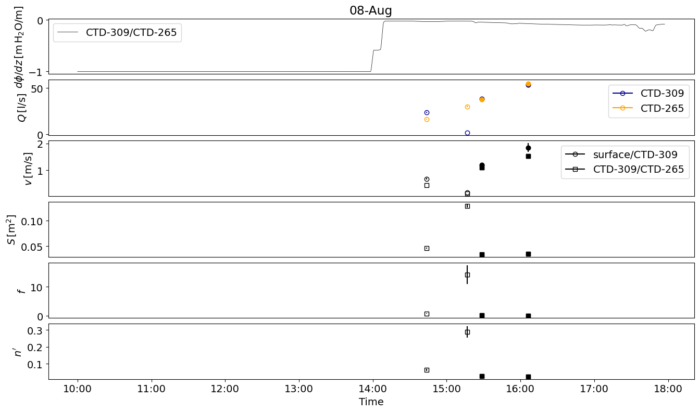

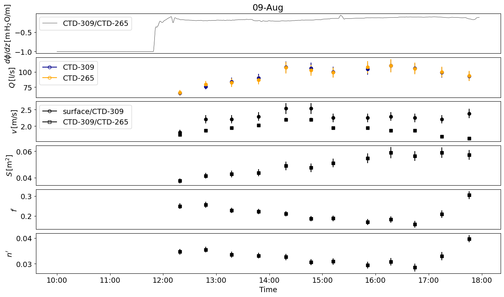

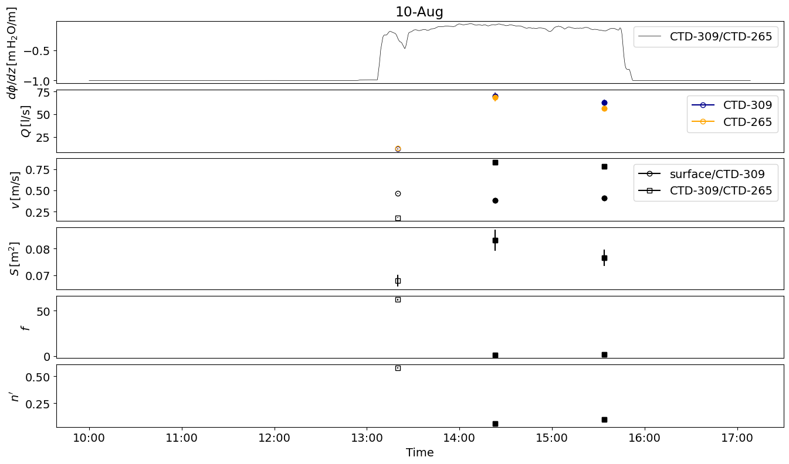

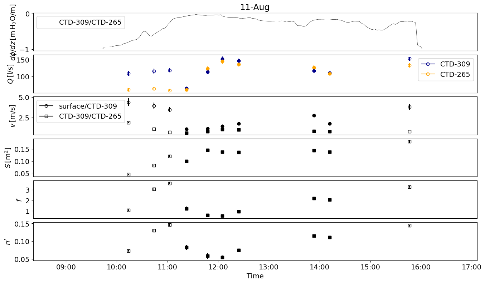

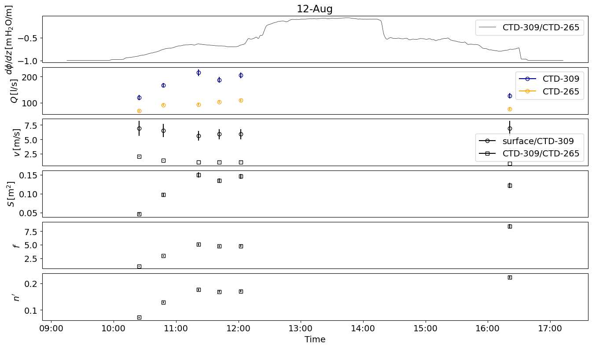

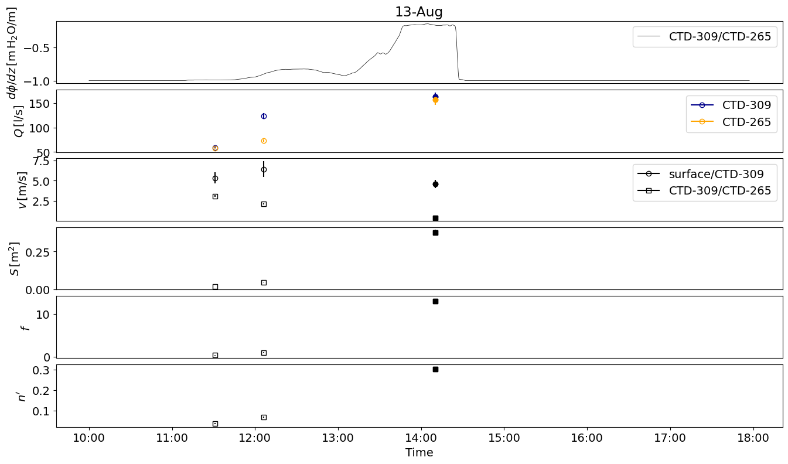

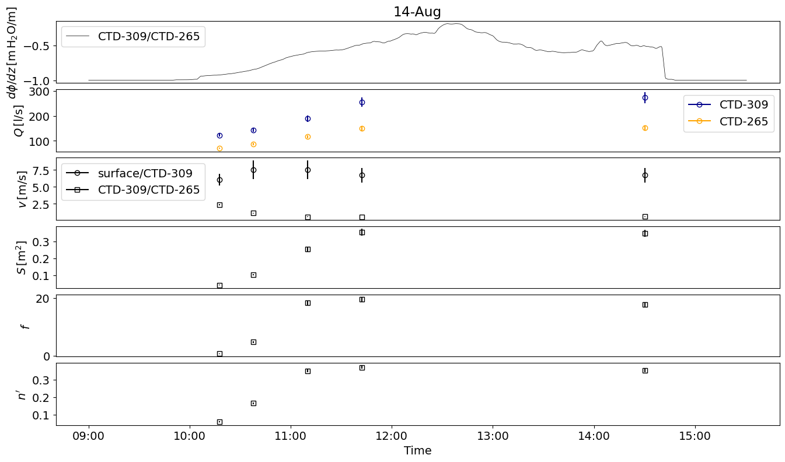

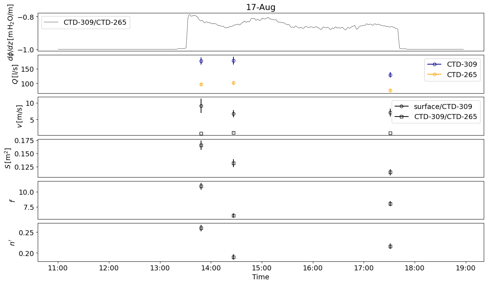

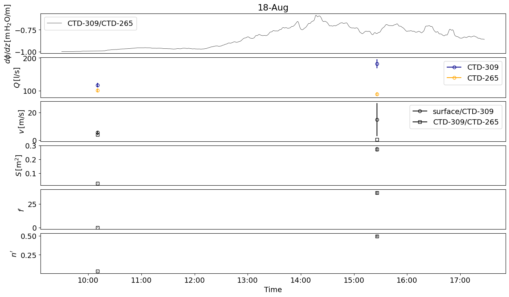

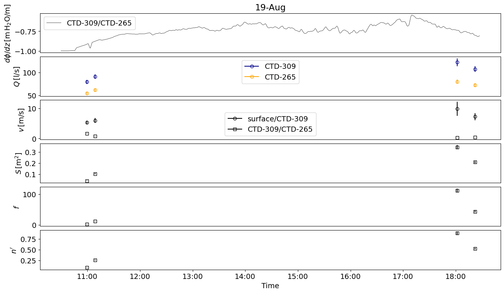

### AM15, 20 and 21 August

In theory the third CTD in AM15 allowed the characterisation of a second channel section between the upper two CTDs.
However, the discharges between the upper two sensors did not agree to within their uncertainties.
Either there was an inflow in between or the discharge at the uppermost sensor was erroneous, potentially because the salt tracer had not mixed across the cross-section or was not completely dissolved yet.
In both cases our results would not be meaningful, hence we decided to focus on the measurements between the two lower sensors.

On 20 August there was hardly any discharge, which was already visible in the field.

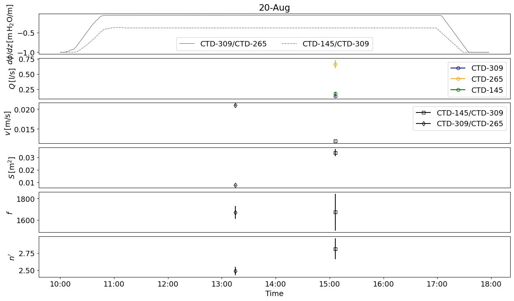

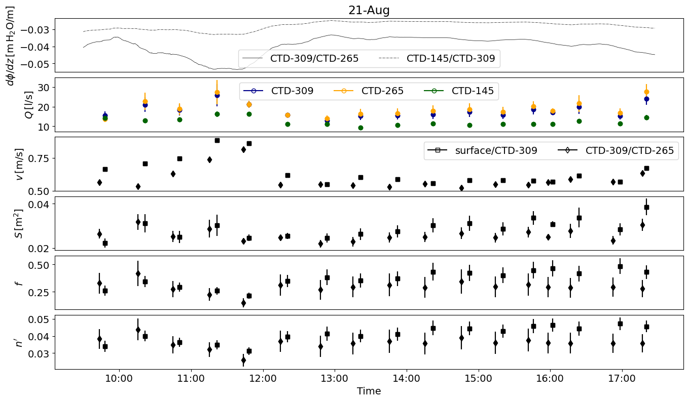

---

*This page was generated using [Literate.jl](https://github.com/fredrikekre/Literate.jl).*

