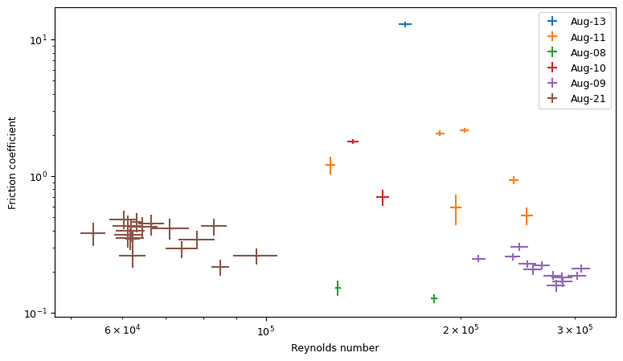
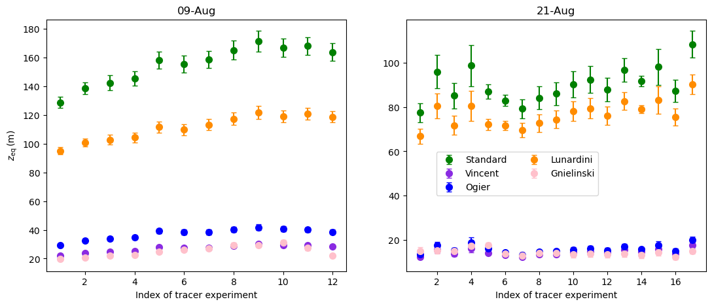
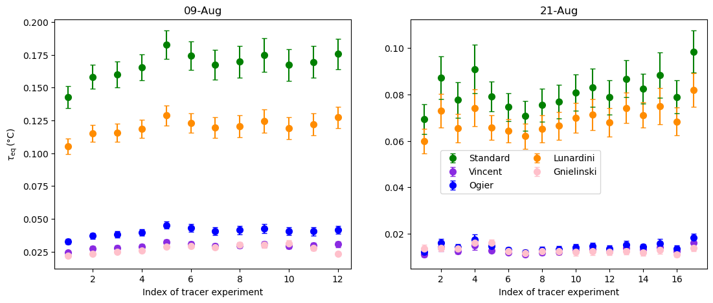
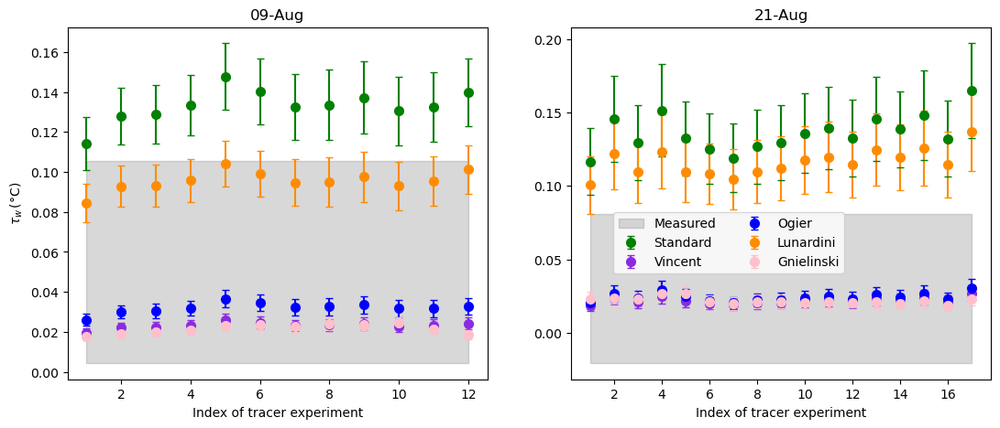
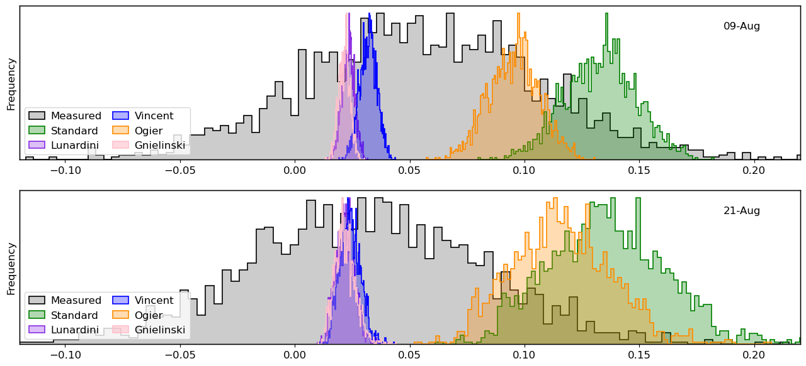

# Figures neither in the paper nor in the supplements

## Moody plot

The Moody plot shows the relation between the Reynolds number and the friction factor.
Between AM15 on 9 August and AM13 on 21 August the friction factor does not change even though the Reynolds numbers are considerably different.

## Thermodynamic variables

These plots are based on the same data as Figure 5 in the paper but instead of daily averages the values for the individual tracer experiments are shown.

### Equilibrating length scale

### Equilibrium offset-temperature

### Water offset-temperature

### Water offset-temperature as a histogram

This plot shows the same data as Figure 5d in the paper but plotted as a histogram instead of an errorbar plot.

---

*This page was generated using [Literate.jl](https://github.com/fredrikekre/Literate.jl).*

