# Raw data plots

### Summary of instrumentation

For the paper we only used the measurements of two DCX-22-CTD sensors, 205309-100mH2O and 207265-300mH2O (referred to as CTD-309 and CTD-265, respectively).
We installed a third one, 205145-10mH2O (CTD-145), on 20 and 21 of August but could not use it for further calculations (see `derived_quantities.pdf`).
Additionally, we monitored the pressure in the artificial moulin over night and the pressure in the supplying water stream and the atmosphere.
From 8 August to 19 August the instruments were installed in AM15 and on 20 and 21 August in AM13.

- 3x DCX-22-CTD: CTD-265, CTD-309 and CTD-145 (the latter was only operating on August 20 and 21), installed at the following depths:

  | Day         | 08.08. | 09.-12.08. | 13.-14.08., 17.-18.08. | 19.08. | 20.-21.08. |
  |------------ | ------ |------------| ---------------------- | ------ | ---------- |
  | CTD-265 [m] |    160 |        167 |                    167 |    167 |        185 |
  | CTD-309 [m] |     60 |        117 |                    127 |    137 |         85 |
  | CTD-145 [m] |      - |          - |                      - |      - |         10 |

- 1x DCX-22 pressure sensor (over night), installed at:

  | Day       | 07.08. | 08.08. | 09.08. | 11.-13.08., 17.-18.08. | 19.08. | 20.08. |
  |---------- | ------ |--------| ------ | ---------------------- | ------ | ------ |
  | Depth [m] |     90 |     75 |    140 |                    150 |    167 |      ? |

- 1x DCX-22AA stage sensor (installed a few metres upstream of artificial moulins), measuring pressure and temperature in the stream and the atmosphere

### Example traces of conductivity

These traces were manually cut out from the conductivity time series and used to calculate the discharges and the mean velocity.

This example shows the traces from the fifth injection on August 21.

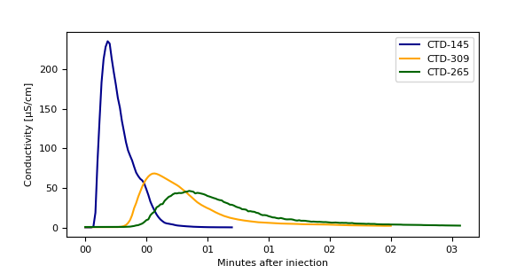

### Time series of individual days

Conductivity, pressure and temperature data from individual days. Note that where the conductivity is greater than the plot limit the sensor was supersaturated.
Calibrations were carried out August 5, 10, 13 and 20.
The temperature data are already corrected according to the zero-degree calibration.
Shaded areas in the temperature plots show the uncertainty (+/- 0.05°C).

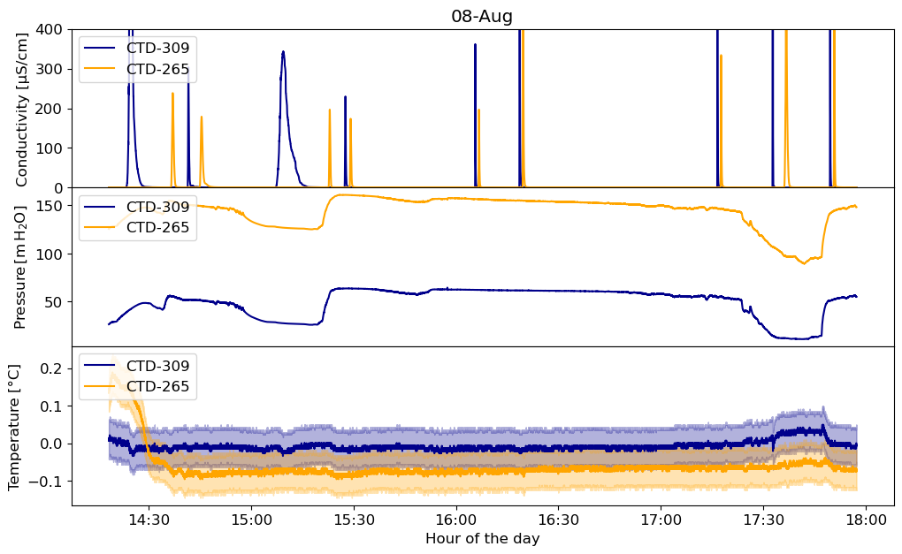

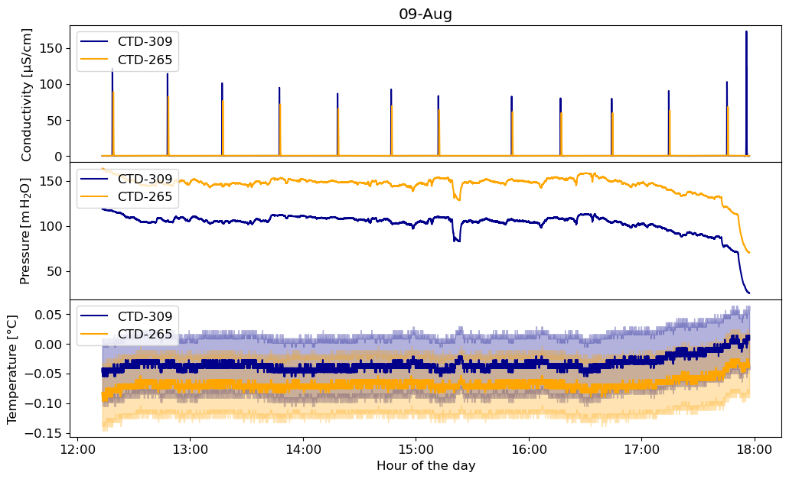

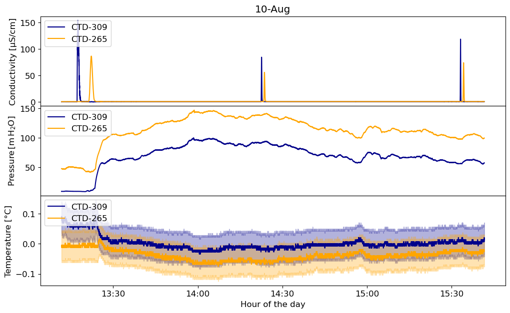

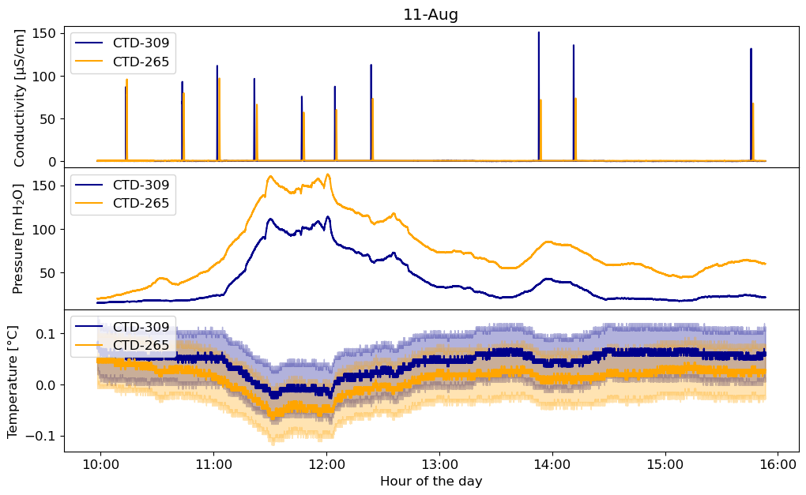

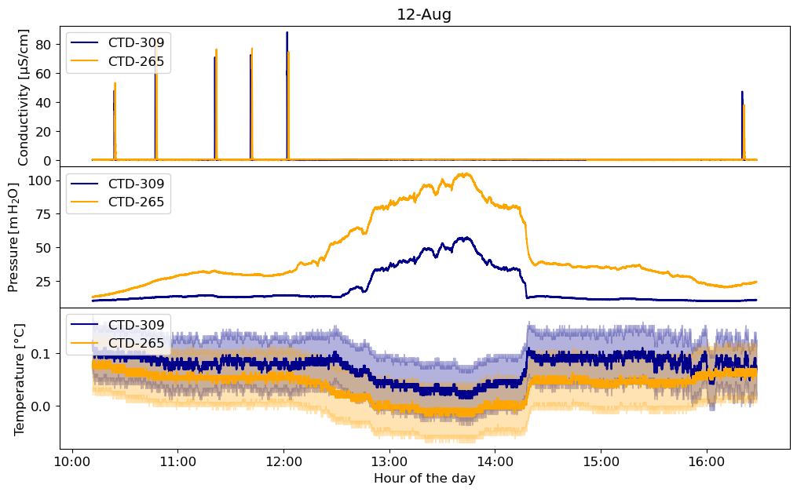

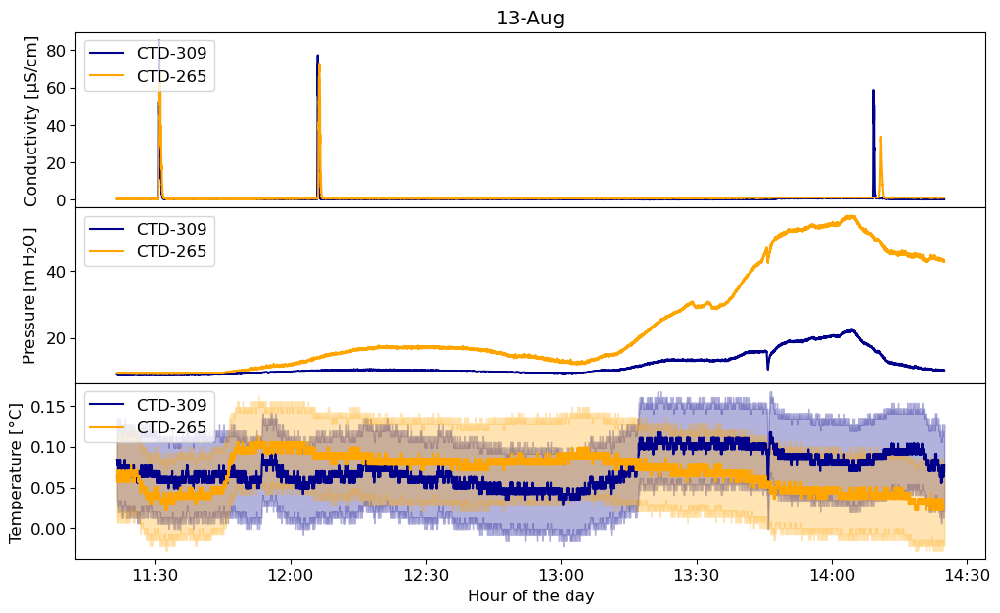

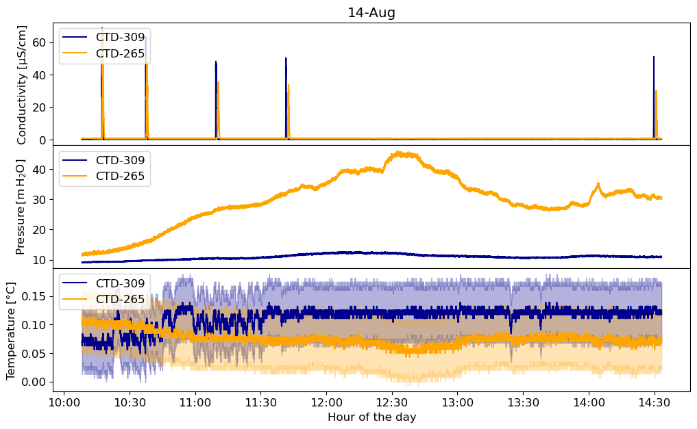

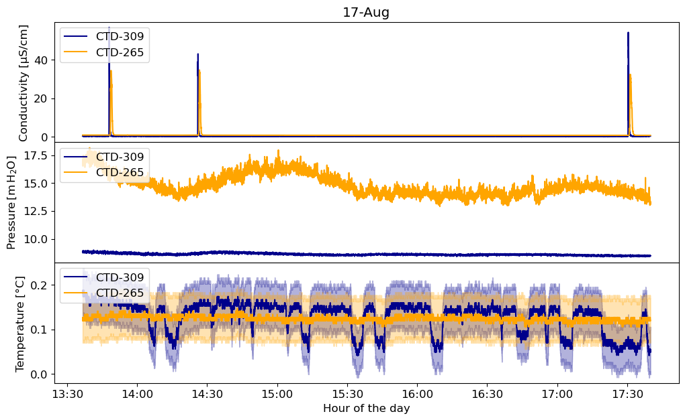

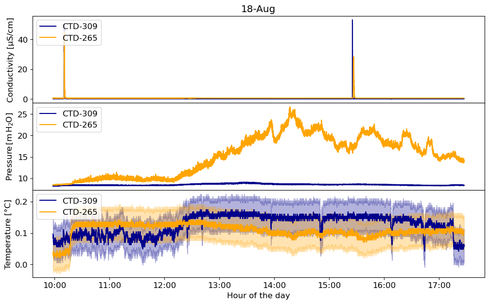

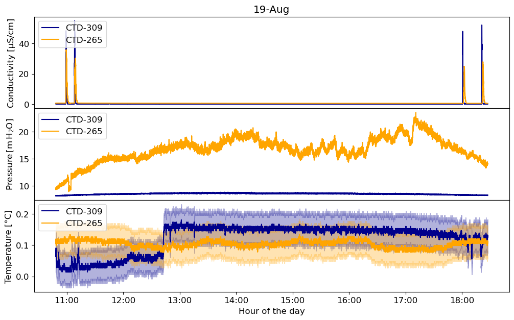

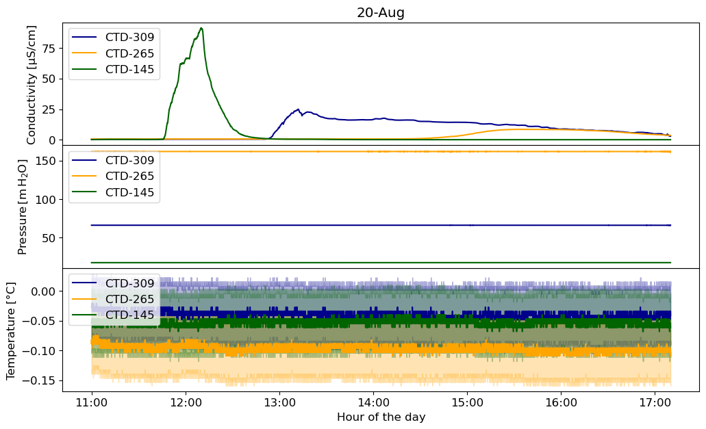

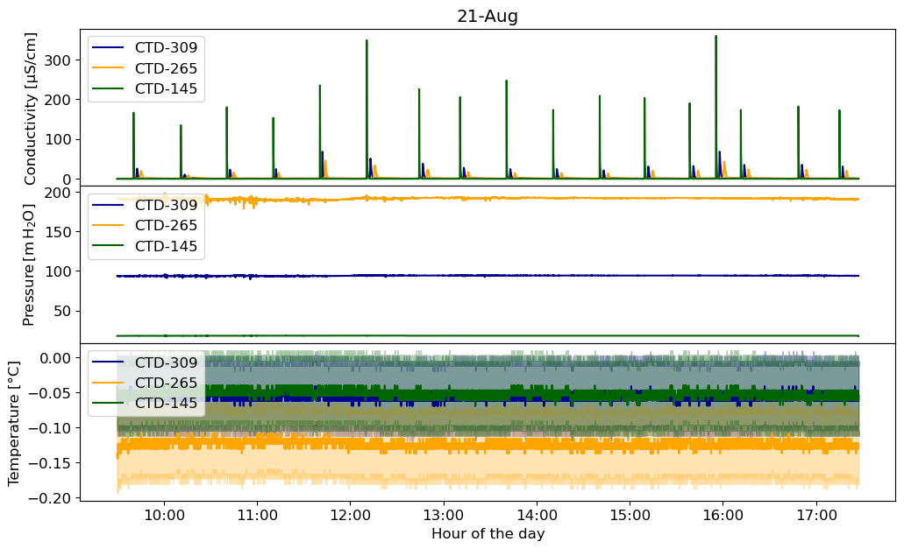

---

*This page was generated using [Literate.jl](https://github.com/fredrikekre/Literate.jl).*

